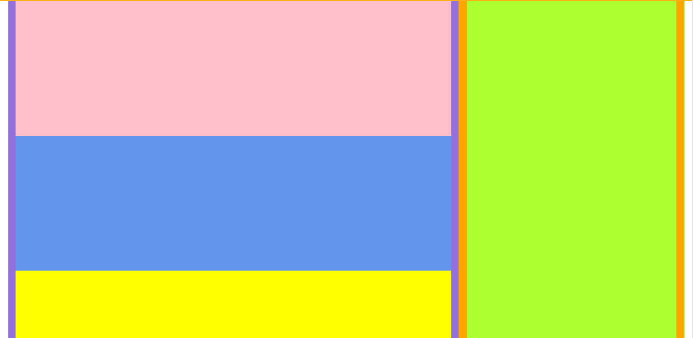

# Flex layout component

## Example mark up

The outer container has class "fl--double-padding", this provides a larger gutter to the left/right of the
container as per request of designers

Layout produced from the below markup: 





```html

<div class="fl fl--flex-direction-column fl--double-padding">                   // white div 
    <div class="fl fl--row fl--flex-grow-1">
        <div class="fl fl--col-8">                                              // purple div 
            <div class="fl fl--flex-direction-column fl--flex-grow-1"> 
                <div class="fl fl--flex-grow-2"></div>                          // pink div 
                <div class="fl fl--flex-grow-2"></div>                          // blue div 
                <div class="fl fl--flex-grow-1"></div>                          // yellow div 
            </div>
        </div>
        <div class="fl fl--col-4">                                              // orange div 
            <div class="fl fl--flex-grow-1">                                    // green div 
            </div>
        </div>
    </div>
</div>

```


## Configurable properties


### fl
* css class: 'fl'
* usage: specifies 'flex' as the rendering box used for an element

### justify-content
* css class: 'fl--justify-content-***'
* usage: defines how the browser distributes space between and around flex items along the main-axis of their container
* values: flex-start / flex-end / center/ space-between / space-around / initial / inherit
* default: flex-start
* reference: https://developer.mozilla.org/en-US/docs/Web/CSS/justify-content

### align-items
* css class: 'fl--align-items-***'
* usage: defines how the browser distributes space between and around flex items along the cross-axis of their 
container. This means it works like justify-content but in the perpendicular direction.
* values: flex-start / flex-end / baseline / center / stretch
* default: stretch
* reference: https://developer.mozilla.org/en-US/docs/Web/CSS/align-items

### align-content
* css class: 'fl--align-content-***'
* usage: aligns a flex container's lines within the flex container when there is extra space on the cross-axis
* values: flex-start / flex-end / center / space-between / space-around / stretch
* default: stretch
* reference: https://developer.mozilla.org/en-US/docs/Web/CSS/align-content

### align-self
* css class: 'fl--align-self-***'
* usage: aligns flex items of the current flex line overriding the align-items value
* values: auto / flex-start / flex-end / center / baseline / stretch
* default: auto
* reference: https://developer.mozilla.org/en-US/docs/Web/CSS/align-self

### flex-direction
* css class: 'fl--flex-direction-***'
* usage: specifies how flex items are placed in the flex container defining the main axis and the direction
* values: row / row-reverse / column / column-reverse
* default: row
* reference: https://developer.mozilla.org/en-US/docs/Web/CSS/flex-direction

### flex-grow
* css class: 'fl--flex-grow-***'
* usage: specifies the flex grow factor of a flex item
* values: 1 / 2 / 3 / 4 / 5 / 6 / 7 / 8 / 9 / 10 / 11
* default: 0
* reference: https://developer.mozilla.org/en-US/docs/Web/CSS/flex-grow

### flex-wrap
* css class: 'fl--flex-wrap-***'
* usage: specifies whether flex items are forced into a single line or can be wrapped onto multiple lines
* values: nowrap / wrap / wrap-reverse
* default: nowrap
* reference: https://developer.mozilla.org/en-US/docs/Web/CSS/flex-wrap

### padding
* markup: class="fl--padding-***"
* values: small / medium / large / top-small / top-medium / top-large / right-small / right-medium / right-large
/ bottom-small / bottom-medium / bottom-large / left-small / left-medium / left-large

### grid padding
* css class: 'fl--double-padding'
* usage: This is probably just used on the outer container to add the additional left / right padding

### grid cols
* css class: 'fl--col-***'
* usage: distributes columns by a certain %
* values: 1 - 12

### grid row
* markup: 'fl--row'
* usage: parent container to col classes
